# GitLab CI/CD + Terraform + AWS + Spring Boot + Angular - Architecture Documentation

## Table of Contents

### 📋 [1. Overview](#overview)
- [1.1 Architecture Vision](#architecture-vision)
- [1.2 Technology Stack](#technology-stack)
- [1.3 Deployment Modes](#deployment-modes)

### 🏗️ [2. System Architecture](#system-architecture)
- [2.1 High-Level Architecture](#high-level-architecture)
- [2.2 AWS Infrastructure](#aws-infrastructure)
- [2.3 Security Architecture](#security-architecture)

### 🚀 [3. Deployment Architectures](#deployment-architectures)
- [3.1 Fargate Container Deployment](#fargate-container-deployment)
- [3.2 S3 Static Site Deployment](#s3-static-site-deployment)
- [3.3 Hybrid Deployment Comparison](#hybrid-deployment-comparison)

### 🔄 [4. CI/CD Pipeline](#cicd-pipeline)
- [4.1 Pipeline Overview](#pipeline-overview)
- [4.2 Pipeline Stages](#pipeline-stages)
- [4.3 Deployment Flow](#deployment-flow)

### 💻 [5. Application Architecture](#application-architecture)
- [5.1 Backend Architecture](#backend-architecture)
- [5.2 Frontend Architecture](#frontend-architecture)
- [5.3 Database Design](#database-design)

### 🔧 [6. Infrastructure as Code](#infrastructure-as-code)
- [6.1 Terraform Structure](#terraform-structure)
- [6.2 Module Dependencies](#module-dependencies)
- [6.3 Environment Management](#environment-management)

### 📊 [7. Monitoring and Observability](#monitoring-and-observability)
- [7.1 Application Monitoring](#application-monitoring)
- [7.2 Infrastructure Monitoring](#infrastructure-monitoring)
- [7.3 Logging Strategy](#logging-strategy)

### 🔐 [8. Security Implementation](#security-implementation)
- [8.1 Network Security](#network-security)
- [8.2 Application Security](#application-security)
- [8.3 WAF Configuration](#waf-configuration)

### 📁 [9. Project Structure](#project-structure)
- [9.1 Repository Layout](#repository-layout)
- [9.2 Module Organization](#module-organization)
- [9.3 Configuration Management](#configuration-management)

### 🎯 [10. Deployment Guide](#deployment-guide)
- [10.1 Prerequisites](#prerequisites)
- [10.2 Deployment Steps](#deployment-steps)
- [10.3 Configuration Options](#configuration-options)

---

## Overview

### Architecture Vision

This project implements a modern, cloud-native DevOps pipeline that demonstrates best practices for:

- **Infrastructure as Code (IaC)** using Terraform for AWS resource management
- **Containerized microservices** with Spring Boot backend on AWS Fargate
- **Modern frontend** with Angular deployed via multiple strategies (containers or static hosting)
- **Comprehensive security** with AWS WAF, VPC isolation, and encryption
- **Automated CI/CD** with GitLab pipelines supporting multiple deployment modes
- **Observability** with built-in monitoring, logging, and health checks

### Technology Stack


### Deployment Modes

The architecture supports two frontend deployment strategies:

1. **Container-based (Fargate)**: Angular served via nginx containers
2. **Static hosting (S3)**: Angular served as static files with CDN
3. **Hybrid mode**: Backend always on Fargate, frontend deployment configurable

---

## System Architecture

### High-Level Architecture

```mermaid
flowchart TB
    subgraph "Internet"
        Users[👥 Users]
        Internet[🌐 Internet]
    end
    
    subgraph "AWS Cloud"
        subgraph "Edge Services"
            WAF[🛡️ AWS WAF]
            CloudFront[🚀 CloudFront CDN]
        end
        
        subgraph "Public Subnets"
            ALB[⚖️ Application Load Balancer]
            NAT[🌐 NAT Gateway]
        end
        
        subgraph "Private Subnets"
            subgraph "Compute"
                Backend[🖥️ Spring Boot<br/>ECS Fargate]
                Frontend[💻 Angular<br/>ECS Fargate]
            end
            
            subgraph "Data"
                RDS[(🗄️ MySQL RDS)]
            end
        end
        
        subgraph "Alternative Frontend"
            S3[📦 S3 Static<br/>Website]
        end
        
        subgraph "Supporting Services"
            ECR[📋 ECR Registry]
            Logs[📊 CloudWatch Logs]
            Secrets[🔐 Secrets Manager]
        end
    end
    
    subgraph "CI/CD"
        GitLab[🦊 GitLab CI/CD]
        Terraform[🏗️ Terraform]
    end
    
    Users --> Internet
    Internet --> WAF
    WAF --> CloudFront
    CloudFront --> ALB
    CloudFront -.-> S3
    ALB --> Backend
    ALB --> Frontend
    Backend --> RDS
    Backend --> Secrets
    Frontend -.->|Alternative| S3
    
    GitLab --> Terraform
    Terraform --> Backend
    Terraform --> Frontend
    Terraform --> S3
    GitLab --> ECR
    
    Backend --> Logs
    Frontend --> Logs
    
    classDef aws fill:#ff9900,stroke:#232f3e,color:#fff
    classDef security fill:#d73027,stroke:#a50026,color:#fff
    classDef compute fill:#3498db,stroke:#2980b9,color:#fff
    classDef data fill:#27ae60,stroke:#229954,color:#fff
    classDef cicd fill:#9b59b6,stroke:#8e44ad,color:#fff
    
    class CloudFront,S3,ALB,Backend,Frontend,RDS,ECR,Logs,Secrets,NAT aws
    class WAF security
    class Backend,Frontend compute
    class RDS data
    class GitLab,Terraform cicd
```

### AWS Infrastructure

The infrastructure leverages multiple AWS availability zones for high availability:


### Security Architecture


---

## Deployment Architectures

### Fargate Container Deployment

```mermaid
sequenceDiagram
    participant Dev as 👨‍💻 Developer
    participant GL as 🦊 GitLab CI/CD
    participant ECR as 📋 ECR Registry
    participant TF as 🏗️ Terraform
    participant ECS as 🚢 ECS Fargate
    participant ALB as ⚖️ Load Balancer
    
    Dev->>GL: Push Code
    GL->>GL: Build & Test
    GL->>ECR: Push Docker Images
    GL->>TF: Deploy Infrastructure
    TF->>ECS: Create Fargate Services
    ECS->>ECR: Pull Images
    ECS->>ALB: Register Targets
    ALB->>ECS: Health Check
    ECS-->>ALB: Healthy Response
    
    note over ECS,ALB: Both Backend & Frontend<br/>running as containers
```

**Advantages:**
- Consistent environment across all components
- Easy scaling and auto-recovery
- Centralized logging and monitoring
- Container-based security isolation

**Use Cases:**
- Development and testing environments
- Applications requiring server-side rendering
- Complex frontend routing requirements
- When container orchestration is preferred

### S3 Static Site Deployment

```mermaid
sequenceDiagram
    participant Dev as 👨‍💻 Developer
    participant GL as 🦊 GitLab CI/CD
    participant S3 as 📦 S3 Bucket
    participant CF as 🚀 CloudFront
    participant Lambda as ⚡ Lambda@Edge
    participant ALB as ⚖️ Load Balancer
    participant ECS as 🚢 Backend Fargate
    
    Dev->>GL: Push Code
    GL->>GL: Build Angular (Prod)
    GL->>S3: Upload Static Files
    GL->>CF: Invalidate Cache
    GL->>ECS: Deploy Backend Only
    
    note over S3,CF: Frontend served as<br/>static files
    note over Lambda: SPA routing support<br/>via Lambda@Edge
    note over ALB,ECS: Backend API<br/>on Fargate
    
    CF->>S3: Serve Static Content
    CF->>Lambda: Handle SPA Routes
    CF->>ALB: Proxy API Requests
    ALB->>ECS: Backend Processing
```

**Advantages:**
- Lower cost for frontend hosting
- Better performance with global CDN
- Reduced infrastructure complexity
- Optimal for static content delivery

**Use Cases:**
- Production environments
- High-traffic applications
- Cost-sensitive deployments
- When CDN performance is critical

### Hybrid Deployment Comparison

```mermaid
graph TB
    subgraph "Decision Matrix"
        subgraph "Container Mode"
            C1[📊 Higher Cost]
            C2[🔧 Complex Setup]
            C3[🚀 Fast Development]
            C4[🔄 Easy Updates]
        end
        
        subgraph "S3 Static Mode"
            S1[💰 Lower Cost]
            S2[⚡ Better Performance]
            S3[🌍 Global CDN]
            S4[📈 Better Scaling]
        end
        
        subgraph "Backend (Always Fargate)"
            B1[🔌 API Services]
            B2[🗄️ Database Access]
            B3[🔐 Authentication]
            B4[📊 Business Logic]
        end
    end
    
    C1 -.-> S1
    C2 -.-> S2
    C3 -.-> S3
    C4 -.-> S4
    
    C1 --> B1
    S1 --> B1
    C2 --> B2
    S2 --> B2
    C3 --> B3
    S3 --> B3
    C4 --> B4
    S4 --> B4
```

---

## CI/CD Pipeline

### Pipeline Overview

```mermaid
graph LR
    subgraph "Source Control"
        A[📝 Code Commit]
    end
    
    subgraph "CI Pipeline"
        B[🔍 Validate]
        C[🏗️ Build]
        D[🧪 Test]
        E[🔒 Security Scan]
        F[📦 Package]
    end
    
    subgraph "CD Pipeline"
        G{🎯 Deployment Mode}
        H1[🚢 Container Deploy]
        H2[📦 S3 Deploy]
        I[✅ Health Check]
        J[📊 Monitor]
    end
    
    A --> B
    B --> C
    C --> D
    D --> E
    E --> F
    F --> G
    G -->|Container Mode| H1
    G -->|Static Mode| H2
    H1 --> I
    H2 --> I
    I --> J
    
    classDef source fill:#e8f4fd,stroke:#3498db
    classDef ci fill:#fef9e7,stroke:#f39c12
    classDef cd fill:#eaf2f8,stroke:#5dade2
    
    class A source
    class B,C,D,E,F ci
    class G,H1,H2,I,J cd
```

### Pipeline Stages

```mermaid
graph TB
    subgraph "Validation Stage"
        V1[🔍 Terraform Format]
        V2[📋 Terraform Validate]
        V3[🧹 Code Linting]
        V4[📏 Code Standards]
    end
    
    subgraph "Build Stage"
        B1[☕ Maven Build<br/>Spring Boot]
        B2[🅰️ Angular Build<br/>Production]
        B3[🐳 Docker Build<br/>Backend Image]
        B4[🐳 Docker Build<br/>Frontend Image]
    end
    
    subgraph "Test Stage"
        T1[🧪 Unit Tests<br/>Backend]
        T2[🧪 Unit Tests<br/>Frontend]
        T3[🔗 Integration Tests]
        T4[🎭 E2E Tests]
    end
    
    subgraph "Security Stage"
        S1[🛡️ SAST Scanning]
        S2[🐳 Container Scanning]
        S3[📦 Dependency Check]
        S4[🔐 Secret Detection]
    end
    
    subgraph "Deploy Stage"
        D1[🏗️ Terraform Plan]
        D2[🚀 Terraform Apply]
        D3[📤 Image Push ECR]
        D4[📦 S3 Upload]
        D5[♻️ ECS Update]
        D6[🔄 CloudFront Invalidate]
    end
    
    V1 --> V2 --> V3 --> V4
    V4 --> B1
    V4 --> B2
    B1 --> B3
    B2 --> B4
    B3 --> T1
    B4 --> T2
    T1 --> T3
    T2 --> T3
    T3 --> T4
    T4 --> S1
    S1 --> S2 --> S3 --> S4
    S4 --> D1
    D1 --> D2
    D2 --> D3
    D2 --> D4
    D3 --> D5
    D4 --> D6
```

### Deployment Flow

```mermaid
sequenceDiagram
    participant Dev as 👨‍💻 Developer
    participant GitLab as 🦊 GitLab
    participant Terraform as 🏗️ Terraform
    participant AWS as ☁️ AWS
    participant Monitor as 📊 Monitoring
    
    Dev->>GitLab: git push
    
    note over GitLab: Validation Stage
    GitLab->>GitLab: Format Check
    GitLab->>GitLab: Terraform Validate
    GitLab->>GitLab: Code Linting
    
    note over GitLab: Build Stage
    GitLab->>GitLab: Maven Build
    GitLab->>GitLab: Angular Build
    GitLab->>GitLab: Docker Build
    
    note over GitLab: Test Stage
    GitLab->>GitLab: Unit Tests
    GitLab->>GitLab: Integration Tests
    GitLab->>GitLab: Security Scans
    
    note over GitLab,AWS: Deployment Stage
    GitLab->>Terraform: terraform plan
    Terraform-->>GitLab: Plan Output
    GitLab->>Terraform: terraform apply
    Terraform->>AWS: Create/Update Resources
    AWS-->>Terraform: Resource Status
    
    alt Container Deployment
        GitLab->>AWS: Push to ECR
        GitLab->>AWS: Update ECS Service
        AWS->>AWS: Rolling Update
    else S3 Deployment
        GitLab->>AWS: Upload to S3
        GitLab->>AWS: Invalidate CloudFront
        AWS->>AWS: Cache Refresh
    end
    
    note over GitLab,Monitor: Health Check Stage
    GitLab->>AWS: Health Check API
    AWS-->>GitLab: Health Status
    GitLab->>Monitor: Update Metrics
    Monitor-->>Dev: Deployment Success
```

---

## Application Architecture

### Backend Architecture


### Frontend Architecture

```mermaid
graph TB
    subgraph "Angular Application"
        subgraph "Core"
            APP[📱 App Component]
            ROUTER[🔀 Router Module]
            AUTH[🔐 Auth Service]
            HTTP[🌐 HTTP Interceptor]
        end
        
        subgraph "Features"
            USER_LIST[👥 User List Component]
            USER_FORM[📝 User Form Component]
            USER_DETAIL[👤 User Detail Component]
            NAV[🧭 Navigation Component]
        end
        
        subgraph "Shared"
            USER_SERVICE[⚙️ User Service]
            MODELS[📊 User Models]
            GUARDS[🛡️ Route Guards]
            UTILS[🔧 Utilities]
        end
        
        subgraph "UI Layer"
            BOOTSTRAP[🎨 Bootstrap 5]
            COMPONENTS[🧩 UI Components]
            STYLES[🎭 Custom Styles]
        end
    end
    
    APP --> ROUTER
    APP --> NAV
    ROUTER --> USER_LIST
    ROUTER --> USER_FORM
    ROUTER --> USER_DETAIL
    
    USER_LIST --> USER_SERVICE
    USER_FORM --> USER_SERVICE
    USER_DETAIL --> USER_SERVICE
    
    USER_SERVICE --> HTTP
    HTTP --> AUTH
    AUTH --> GUARDS
    
    USER_SERVICE --> MODELS
    
    USER_LIST --> BOOTSTRAP
    USER_FORM --> BOOTSTRAP
    USER_DETAIL --> BOOTSTRAP
    NAV --> BOOTSTRAP
    
    BOOTSTRAP --> COMPONENTS
    COMPONENTS --> STYLES
```

### Database Design


---

## Infrastructure as Code

### Terraform Structure

```mermaid
graph TB
    subgraph "Root Configuration"
        MAIN[📄 main.tf]
        VARS[⚙️ variables.tf]
        OUTPUTS[📤 outputs.tf]
        ENVS[🌍 environments.tf]
    end
    
    subgraph "VPC Module"
        VPC_MAIN[🌐 vpc/main.tf]
        VPC_VARS[⚙️ vpc/variables.tf]
        VPC_OUT[📤 vpc/outputs.tf]
    end
    
    subgraph "ECS Module"
        ECS_MAIN[🚢 ecs/main.tf]
        ECS_VARS[⚙️ ecs/variables.tf]
        ECS_OUT[📤 ecs/outputs.tf]
        ECS_TASK[📋 ecs/task-definitions/]
    end
    
    subgraph "RDS Module"
        RDS_MAIN[🗄️ rds/main.tf]
        RDS_VARS[⚙️ rds/variables.tf]
        RDS_OUT[📤 rds/outputs.tf]
    end
    
    subgraph "S3 Module"
        S3_MAIN[📦 s3/main.tf]
        S3_VARS[⚙️ s3/variables.tf]
        S3_OUT[📤 s3/outputs.tf]
    end
    
    subgraph "CloudFront Module"
        CF_MAIN[🚀 cloudfront/main.tf]
        CF_VARS[⚙️ cloudfront/variables.tf]
        CF_OUT[📤 cloudfront/outputs.tf]
        CF_LAMBDA[⚡ cloudfront/lambda/]
    end
    
    subgraph "WAF Module"
        WAF_MAIN[🛡️ waf/main.tf]
        WAF_VARS[⚙️ waf/variables.tf]
        WAF_OUT[📤 waf/outputs.tf]
    end
    
    MAIN --> VPC_MAIN
    MAIN --> ECS_MAIN
    MAIN --> RDS_MAIN
    MAIN --> S3_MAIN
    MAIN --> CF_MAIN
    MAIN --> WAF_MAIN
    
    VPC_OUT --> ECS_VARS
    VPC_OUT --> RDS_VARS
    ECS_OUT --> CF_VARS
    S3_OUT --> CF_VARS
    WAF_OUT --> CF_VARS
```

### Module Dependencies

```mermaid
graph LR
    subgraph "Foundation Layer"
        VPC[🌐 VPC Module]
        IAM[🔐 IAM Module]
        WAF[🛡️ WAF Module]
    end
    
    subgraph "Compute Layer"
        ECS[🚢 ECS Module]
        ALB[⚖️ ALB Module]
        S3[📦 S3 Module]
    end
    
    subgraph "Data Layer"
        RDS[🗄️ RDS Module]
        SECRETS[🗝️ Secrets Module]
    end
    
    subgraph "Edge Layer"
        CLOUDFRONT[🚀 CloudFront Module]
        LAMBDA[⚡ Lambda@Edge]
    end
    
    VPC --> ECS
    VPC --> ALB
    VPC --> RDS
    IAM --> ECS
    IAM --> RDS
    IAM --> S3
    
    ECS --> CLOUDFRONT
    ALB --> CLOUDFRONT
    S3 --> CLOUDFRONT
    WAF --> CLOUDFRONT
    
    CLOUDFRONT --> LAMBDA
    
    RDS --> SECRETS
    ECS --> SECRETS
    
    classDef foundation fill:#e8f4fd,stroke:#3498db
    classDef compute fill:#fef9e7,stroke:#f39c12
    classDef data fill:#eaf2f8,stroke:#27ae60
    classDef edge fill:#fdf2e9,stroke:#e67e22
    
    class VPC,IAM,WAF foundation
    class ECS,ALB,S3 compute
    class RDS,SECRETS data
    class CLOUDFRONT,LAMBDA edge
```

### Environment Management

```mermaid
graph TB
    subgraph "Environment Strategy"
        subgraph "Development"
            DEV_VPC[🌐 dev-vpc]
            DEV_ECS[🚢 dev-ecs]
            DEV_RDS[🗄️ dev-rds-small]
        end
        
        subgraph "Staging"
            STG_VPC[🌐 staging-vpc]
            STG_ECS[🚢 staging-ecs]
            STG_RDS[🗄️ staging-rds-medium]
        end
        
        subgraph "Production"
            PROD_VPC[🌐 prod-vpc]
            PROD_ECS[🚢 prod-ecs-ha]
            PROD_RDS[🗄️ prod-rds-large]
            PROD_CF[🚀 prod-cloudfront]
        end
        
        subgraph "Shared Resources"
            ECR[📋 ECR Registry]
            WAF[🛡️ WAF Rules]
            ROUTE53[🌍 Route53 DNS]
        end
    end
    
    DEV_VPC -.-> ECR
    STG_VPC -.-> ECR
    PROD_VPC -.-> ECR
    
    PROD_CF --> WAF
    PROD_CF --> ROUTE53
    
    note over DEV_VPC,DEV_RDS "Minimal resources<br/>Single AZ<br/>Shared instances"
    note over STG_VPC,STG_RDS "Production-like<br/>Multi-AZ<br/>Performance testing"
    note over PROD_VPC,PROD_RDS "High availability<br/>Auto-scaling<br/>Full monitoring"
```

---

## Monitoring and Observability

### Application Monitoring

```mermaid
graph TB
    subgraph "Application Metrics"
        subgraph "Spring Boot Actuator"
            HEALTH[❤️ Health Checks]
            METRICS[📊 Custom Metrics]
            INFO[ℹ️ Application Info]
            ENV[🔧 Environment]
        end
        
        subgraph "Business Metrics"
            USER_COUNT[👥 User Count]
            API_CALLS[📞 API Calls]
            RESPONSE_TIME[⏱️ Response Time]
            ERROR_RATE[❌ Error Rate]
        end
    end
    
    subgraph "Infrastructure Metrics"
        CPU[💻 CPU Usage]
        MEMORY[🧠 Memory Usage]
        NETWORK[🌐 Network I/O]
        DISK[💾 Disk Usage]
    end
    
    subgraph "Monitoring Stack"
        CLOUDWATCH[📊 CloudWatch]
        ALARMS[🚨 CloudWatch Alarms]
        SNS[📧 SNS Notifications]
    end
    
    HEALTH --> CLOUDWATCH
    METRICS --> CLOUDWATCH
    USER_COUNT --> CLOUDWATCH
    API_CALLS --> CLOUDWATCH
    RESPONSE_TIME --> CLOUDWATCH
    ERROR_RATE --> CLOUDWATCH
    
    CPU --> CLOUDWATCH
    MEMORY --> CLOUDWATCH
    NETWORK --> CLOUDWATCH
    DISK --> CLOUDWATCH
    
    CLOUDWATCH --> ALARMS
    ALARMS --> SNS
```

### Infrastructure Monitoring

```mermaid
sequenceDiagram
    participant App as 🚀 Application
    participant ALB as ⚖️ Load Balancer
    participant ECS as 🚢 ECS Service
    participant CW as 📊 CloudWatch
    participant SNS as 📧 SNS
    participant Team as 👥 DevOps Team
    
    loop Every 30 seconds
        ALB->>App: Health Check
        App-->>ALB: HTTP 200 + Health Status
        ALB->>CW: Log Health Status
    end
    
    loop Every 1 minute
        ECS->>CW: Container Metrics
        App->>CW: Application Metrics
        CW->>CW: Evaluate Alarms
    end
    
    alt Unhealthy Service
        CW->>SNS: Trigger Alarm
        SNS->>Team: Send Alert
        ECS->>ECS: Replace Unhealthy Tasks
    else Resource Threshold
        CW->>ECS: Trigger Auto-scaling
        ECS->>ECS: Scale Up/Down
    end
    
    note over App,CW: Continuous monitoring<br/>of health and performance
```

### Logging Strategy

```mermaid
flowchart LR
    subgraph "Log Sources"
        APP[📱 Application Logs]
        ACCESS[🌐 Access Logs]
        ERROR[❌ Error Logs]
        AUDIT[📋 Audit Logs]
    end
    
    subgraph "Log Aggregation"
        CLOUDWATCH_LOGS[📊 CloudWatch Logs]
        LOG_GROUPS[📁 Log Groups]
        LOG_STREAMS[🌊 Log Streams]
    end
    
    subgraph "Log Processing"
        FILTERS[🔍 Metric Filters]
        INSIGHTS[🧠 CloudWatch Insights]
        DASHBOARDS[📈 Dashboards]
    end
    
    subgraph "Alerting"
        ALARMS[🚨 Log-based Alarms]
        NOTIFICATIONS[📧 Notifications]
    end
    
    APP --> CLOUDWATCH_LOGS
    ACCESS --> CLOUDWATCH_LOGS
    ERROR --> CLOUDWATCH_LOGS
    AUDIT --> CLOUDWATCH_LOGS
    
    CLOUDWATCH_LOGS --> LOG_GROUPS
    LOG_GROUPS --> LOG_STREAMS
    
    LOG_STREAMS --> FILTERS
    LOG_STREAMS --> INSIGHTS
    LOG_STREAMS --> DASHBOARDS
    
    FILTERS --> ALARMS
    ALARMS --> NOTIFICATIONS
    
    classDef logs fill:#f4f4f4,stroke:#333
    classDef processing fill:#e1f5fe,stroke:#0277bd
    classDef alerts fill:#ffebee,stroke:#c62828
    
    class APP,ACCESS,ERROR,AUDIT logs
    class FILTERS,INSIGHTS,DASHBOARDS processing
    class ALARMS,NOTIFICATIONS alerts
```

---

## Security Implementation

### Network Security


### Application Security

```mermaid
sequenceDiagram
    participant Client as 👤 Client
    participant WAF as 🛡️ WAF
    participant ALB as ⚖️ Load Balancer
    participant App as 🚀 Spring Boot
    participant DB as 🗄️ Database
    participant Secrets as 🗝️ Secrets Manager
    
    Client->>WAF: HTTPS Request
    WAF->>WAF: Rate Limiting Check
    WAF->>WAF: SQL Injection Check
    WAF->>WAF: XSS Protection
    
    alt Request Blocked
        WAF-->>Client: 403 Forbidden
    else Request Allowed
        WAF->>ALB: Forward Request
        ALB->>ALB: SSL Termination
        ALB->>App: HTTP Request
        
        App->>App: JWT Validation
        App->>App: CORS Check
        App->>App: CSRF Protection
        
        alt Authentication Required
            App->>Secrets: Get JWT Secret
            Secrets-->>App: JWT Secret
            App->>App: Validate Token
        end
        
        App->>Secrets: Get DB Credentials
        Secrets-->>App: DB Credentials
        App->>DB: Encrypted Connection
        DB-->>App: Query Results
        App-->>ALB: JSON Response
        ALB-->>WAF: Response
        WAF-->>Client: HTTPS Response
    end
    
    note over Client,Secrets: End-to-end encryption<br/>Multiple security layers
```

### WAF Configuration

```mermaid
graph TB
    subgraph "AWS WAF Rules"
        subgraph "Core Protection"
            RATE[📊 Rate Limiting<br/>100 req/5min]
            GEO[🌍 Geo Blocking<br/>Specific Countries]
            SIZE[📏 Size Restrictions<br/>Max 8KB body]
        end
        
        subgraph "OWASP Top 10"
            SQL[🛡️ SQL Injection<br/>Pattern Matching]
            XSS[🔒 XSS Protection<br/>Script Detection]
            LFI[📁 Local File Inclusion<br/>Path Traversal]
        end
        
        subgraph "Custom Rules"
            API[🔌 API Protection<br/>/api/* endpoints]
            ADMIN[👑 Admin Protection<br/>/admin/* endpoints]
            BOT[🤖 Bot Detection<br/>User-Agent analysis]
        end
        
        subgraph "Actions"
            ALLOW[✅ Allow]
            BLOCK[❌ Block]
            COUNT[📊 Count Only]
            CAPTCHA[🧩 CAPTCHA Challenge]
        end
    end
    
    RATE --> BLOCK
    GEO --> BLOCK
    SIZE --> BLOCK
    
    SQL --> BLOCK
    XSS --> BLOCK
    LFI --> BLOCK
    
    API --> COUNT
    ADMIN --> CAPTCHA
    BOT --> CAPTCHA
    
    classDef protection fill:#e3f2fd,stroke:#1976d2
    classDef owasp fill:#f3e5f5,stroke:#7b1fa2
    classDef custom fill:#e8f5e8,stroke:#388e3c
    classDef actions fill:#fff3e0,stroke:#f57c00
    
    class RATE,GEO,SIZE protection
    class SQL,XSS,LFI owasp
    class API,ADMIN,BOT custom
    class ALLOW,BLOCK,COUNT,CAPTCHA actions
```

---

## Project Structure

### Repository Layout

```
📁 gitlab-ci-terraform-aws-fargate-springboot-angular-cloudfront-waf/
├── 📄 README.md
├── 📄 ARCHITECTURE.md
├── 📄 requirements.md
├── 📄 .gitlab-ci.yml
├── 📄 .gitignore
│
├── 📁 backend/
│   ├── 📄 Dockerfile
│   ├── 📄 pom.xml
│   ├── 📁 src/
│   │   └── 📁 main/
│   │       ├── 📁 java/
│   │       │   └── 📁 com/example/demo/
│   │       │       ├── 📄 DemoApplication.java
│   │       │       ├── 📁 controller/
│   │       │       ├── 📁 service/
│   │       │       ├── 📁 repository/
│   │       │       ├── 📁 model/
│   │       │       └── 📁 config/
│   │       └── 📁 resources/
│   │           ├── 📄 application.yml
│   │           └── 📄 application-prod.yml
│   └── 📁 src/test/
│
├── 📁 frontend/
│   ├── 📄 Dockerfile
│   ├── 📄 package.json
│   ├── 📄 angular.json
│   ├── 📄 tsconfig.json
│   ├── 📁 src/
│   │   ├── 📄 main.ts
│   │   ├── 📁 app/
│   │   │   ├── 📄 app.component.ts
│   │   │   ├── 📄 app.routes.ts
│   │   │   ├── 📁 components/
│   │   │   ├── 📁 services/
│   │   │   ├── 📁 models/
│   │   │   └── 📁 guards/
│   │   ├── 📁 assets/
│   │   └── 📁 environments/
│   └── 📄 nginx.conf
│
├── 📁 terraform/
│   ├── 📄 main.tf
│   ├── 📄 variables.tf
│   ├── 📄 outputs.tf
│   ├── 📄 environments.tf
│   ├── 📄 terraform.tfvars.example
│   └── 📁 modules/
│       ├── 📁 vpc/
│       ├── 📁 ecs/
│       ├── 📁 rds/
│       ├── 📁 alb/
│       ├── 📁 s3/
│       ├── 📁 cloudfront/
│       └── 📁 waf/
│
├── 📁 scripts/
│   ├── 📄 deploy.sh
│   ├── 📄 health-check.sh
│   ├── 📄 s3-deploy.sh
│   └── 📄 setup-env.sh
│
└── 📁 docs/
    ├── 📄 DEPLOYMENT.md
    ├── 📄 TROUBLESHOOTING.md
    └── 📁 diagrams/
```

### Module Organization

```mermaid
graph TB
    subgraph "Terraform Modules"
        subgraph "Network Layer"
            VPC_MOD[🌐 VPC Module<br/>• Subnets<br/>• Route Tables<br/>• NAT Gateways<br/>• Internet Gateway]
        end
        
        subgraph "Security Layer"
            WAF_MOD[🛡️ WAF Module<br/>• Web ACL<br/>• Rule Groups<br/>• IP Sets<br/>• Rate Limiting]
            
            SG_MOD[🔒 Security Groups<br/>• ALB Rules<br/>• ECS Rules<br/>• RDS Rules]
        end
        
        subgraph "Compute Layer"
            ECS_MOD[🚢 ECS Module<br/>• Cluster<br/>• Services<br/>• Task Definitions<br/>• Auto Scaling]
            
            ALB_MOD[⚖️ ALB Module<br/>• Load Balancer<br/>• Target Groups<br/>• Listeners<br/>• Health Checks]
        end
        
        subgraph "Storage Layer"
            RDS_MOD[🗄️ RDS Module<br/>• MySQL Instance<br/>• Subnet Group<br/>• Parameter Group<br/>• Backups]
            
            S3_MOD[📦 S3 Module<br/>• Static Hosting<br/>• CORS Config<br/>• Lifecycle Rules<br/>• Encryption]
        end
        
        subgraph "Edge Layer"
            CF_MOD[🚀 CloudFront Module<br/>• Distribution<br/>• Origins<br/>• Behaviors<br/>• Lambda@Edge]
        end
    end
    
    VPC_MOD --> ECS_MOD
    VPC_MOD --> ALB_MOD
    VPC_MOD --> RDS_MOD
    
    WAF_MOD --> CF_MOD
    SG_MOD --> ECS_MOD
    SG_MOD --> ALB_MOD
    SG_MOD --> RDS_MOD
    
    ECS_MOD --> ALB_MOD
    ALB_MOD --> CF_MOD
    S3_MOD --> CF_MOD
    
    classDef network fill:#e3f2fd,stroke:#1976d2
    classDef security fill:#f3e5f5,stroke:#7b1fa2
    classDef compute fill:#e8f5e8,stroke:#388e3c
    classDef storage fill:#fff3e0,stroke:#f57c00
    classDef edge fill:#fce4ec,stroke:#c2185b
    
    class VPC_MOD network
    class WAF_MOD,SG_MOD security
    class ECS_MOD,ALB_MOD compute
    class RDS_MOD,S3_MOD storage
    class CF_MOD edge
```

### Configuration Management

```mermaid
graph LR
    subgraph "Configuration Sources"
        TFVARS[📄 terraform.tfvars]
        ENV_VARS[🔧 Environment Variables]
        GITLAB_VARS[🦊 GitLab Variables]
        SECRETS[🗝️ AWS Secrets Manager]
    end
    
    subgraph "Configuration Types"
        INFRA[🏗️ Infrastructure Config<br/>• VPC CIDR<br/>• Instance Types<br/>• Scaling Limits]
        
        APP[📱 Application Config<br/>• Database URL<br/>• API Endpoints<br/>• Feature Flags]
        
        SECURITY[🔐 Security Config<br/>• JWT Secrets<br/>• API Keys<br/>• Certificates]
        
        DEPLOY[🚀 Deployment Config<br/>• Image Tags<br/>• Environment Names<br/>• Resource Names]
    end
    
    TFVARS --> INFRA
    ENV_VARS --> APP
    GITLAB_VARS --> DEPLOY
    SECRETS --> SECURITY
    
    INFRA --> DEPLOY
    APP --> DEPLOY
    SECURITY --> DEPLOY
    
    classDef source fill:#e8f4fd,stroke:#3498db
    classDef config fill:#fef9e7,stroke:#f39c12
    classDef final fill:#eaf2f8,stroke:#27ae60
    
    class TFVARS,ENV_VARS,GITLAB_VARS,SECRETS source
    class INFRA,APP,SECURITY config
    class DEPLOY final
```

---

## Deployment Guide

### Prerequisites

Before deploying this architecture, ensure you have:

```mermaid
graph TB
    subgraph "Required Tools"
        AWS_CLI[☁️ AWS CLI v2+<br/>Configured with credentials]
        TERRAFORM[🏗️ Terraform v1.5+<br/>Version constraints defined]
        DOCKER[🐳 Docker<br/>For local builds]
        GIT[📝 Git<br/>Repository access]
    end
    
    subgraph "AWS Prerequisites"
        IAM_USER[👤 IAM User/Role<br/>Admin permissions]
        S3_BACKEND[📦 S3 Bucket<br/>Terraform state]
        DOMAIN[🌍 Route53 Domain<br/>Optional for custom DNS]
        CERTIFICATES[🔒 SSL Certificates<br/>ACM managed]
    end
    
    subgraph "GitLab Setup"
        CI_VARS[🔧 CI/CD Variables<br/>AWS credentials]
        RUNNERS[🏃 GitLab Runners<br/>Docker executor]
        PERMISSIONS[🔐 Repository Access<br/>Maintainer role]
    end
    
    AWS_CLI -.-> IAM_USER
    TERRAFORM -.-> S3_BACKEND
    GIT -.-> CI_VARS
    DOCKER -.-> RUNNERS
    
    classDef tools fill:#e3f2fd,stroke:#1976d2
    classDef aws fill:#ff9900,stroke:#232f3e,color:#fff
    classDef gitlab fill:#fc6d26,stroke:#e24329,color:#fff
    
    class AWS_CLI,TERRAFORM,DOCKER,GIT tools
    class IAM_USER,S3_BACKEND,DOMAIN,CERTIFICATES aws
    class CI_VARS,RUNNERS,PERMISSIONS gitlab
```

### Deployment Steps

```mermaid
sequenceDiagram
    participant Dev as 👨‍💻 Developer
    participant Git as 📝 Git Repository
    participant GitLab as 🦊 GitLab CI/CD
    participant AWS as ☁️ AWS
    participant App as 🚀 Application
    
    note over Dev,AWS: Initial Setup Phase
    Dev->>Git: Clone repository
    Dev->>Dev: Configure terraform.tfvars
    Dev->>Dev: Set GitLab CI variables
    
    note over Dev,AWS: Infrastructure Deployment
    Dev->>Git: git push (infra changes)
    Git->>GitLab: Trigger pipeline
    GitLab->>GitLab: Validate Terraform
    GitLab->>AWS: terraform plan
    GitLab->>AWS: terraform apply
    AWS-->>GitLab: Infrastructure ready
    
    note over Dev,AWS: Application Deployment
    Dev->>Git: git push (app changes)
    Git->>GitLab: Trigger pipeline
    GitLab->>GitLab: Build applications
    GitLab->>GitLab: Run tests
    GitLab->>AWS: Push images/files
    
    alt Container Deployment
        GitLab->>AWS: Update ECS services
        AWS->>App: Deploy containers
    else S3 Deployment
        GitLab->>AWS: Upload to S3
        GitLab->>AWS: Invalidate CloudFront
    end
    
    note over Dev,AWS: Verification Phase
    GitLab->>App: Health checks
    App-->>GitLab: Status OK
    GitLab-->>Dev: Deployment success
    
    Dev->>App: Test application
    App-->>Dev: Application running
```

### Configuration Options

```mermaid
graph TB
    subgraph "Deployment Configuration"
        subgraph "Frontend Options"
            CONTAINER_FE[🚢 Container Mode<br/>• ECS Fargate<br/>• Nginx serving<br/>• Auto-scaling]
            
            STATIC_FE[📦 Static Mode<br/>• S3 hosting<br/>• CloudFront CDN<br/>• Global edge caching]
        end
        
        subgraph "Environment Options"
            DEV_ENV[🔧 Development<br/>• Single AZ<br/>• Minimal resources<br/>• Debug enabled]
            
            PROD_ENV[🏭 Production<br/>• Multi-AZ<br/>• High availability<br/>• Monitoring enabled]
        end
        
        subgraph "Scaling Options"
            MANUAL_SCALE[👤 Manual Scaling<br/>• Fixed capacity<br/>• Cost predictable<br/>• Simple management]
            
            AUTO_SCALE[🔄 Auto Scaling<br/>• Dynamic capacity<br/>• Cost optimized<br/>• Performance based]
        end
        
        subgraph "Security Options"
            BASIC_SEC[🔒 Basic Security<br/>• Security groups<br/>• HTTPS only<br/>• Basic WAF]
            
            ADVANCED_SEC[🛡️ Advanced Security<br/>• Full WAF rules<br/>• Network ACLs<br/>• Advanced monitoring]
        end
    end
    
    CONTAINER_FE -.-> DEV_ENV
    STATIC_FE -.-> PROD_ENV
    
    DEV_ENV -.-> MANUAL_SCALE
    PROD_ENV -.-> AUTO_SCALE
    
    MANUAL_SCALE -.-> BASIC_SEC
    AUTO_SCALE -.-> ADVANCED_SEC
    
    classDef frontend fill:#e3f2fd,stroke:#1976d2
    classDef environment fill:#f3e5f5,stroke:#7b1fa2
    classDef scaling fill:#e8f5e8,stroke:#388e3c
    classDef security fill:#fff3e0,stroke:#f57c00
    
    class CONTAINER_FE,STATIC_FE frontend
    class DEV_ENV,PROD_ENV environment
    class MANUAL_SCALE,AUTO_SCALE scaling
    class BASIC_SEC,ADVANCED_SEC security
```

---

## Quick Navigation

🔝 [Back to Top](#gitlab-cicd--terraform--aws--spring-boot--angular---architecture-documentation)

### Key Sections:
- 📋 [Project Overview](#overview) - Understanding the architecture vision
- 🏗️ [System Architecture](#system-architecture) - High-level design and AWS infrastructure
- 🚀 [Deployment Options](#deployment-architectures) - Fargate vs S3 deployment modes
- 🔄 [CI/CD Pipeline](#cicd-pipeline) - Automated deployment workflows
- 💻 [Applications](#application-architecture) - Backend and frontend architecture
- 🔧 [Infrastructure](#infrastructure-as-code) - Terraform modules and configuration
- 📊 [Monitoring](#monitoring-and-observability) - Observability and alerting
- 🔐 [Security](#security-implementation) - Comprehensive security measures
- 📁 [Project Structure](#project-structure) - Repository organization
- 🎯 [Deployment Guide](#deployment-guide) - Step-by-step deployment

### External Links:
- [Spring Boot Documentation](https://spring.io/projects/spring-boot)
- [Angular Documentation](https://angular.io/docs)
- [Terraform AWS Provider](https://registry.terraform.io/providers/hashicorp/aws/latest/docs)
- [AWS ECS Documentation](https://docs.aws.amazon.com/ecs/)
- [GitLab CI/CD Documentation](https://docs.gitlab.com/ee/ci/)

---

**Last Updated:** November 5, 2025  
**Version:** 1.0.0  
**Maintainer:** DevOps Team

> **📝 Edit this file:** This is the master copy. Changes are automatically synced to `docs/ARCHITECTURE.md` for GitLab Pages via the GitLab CI/CD pipeline.