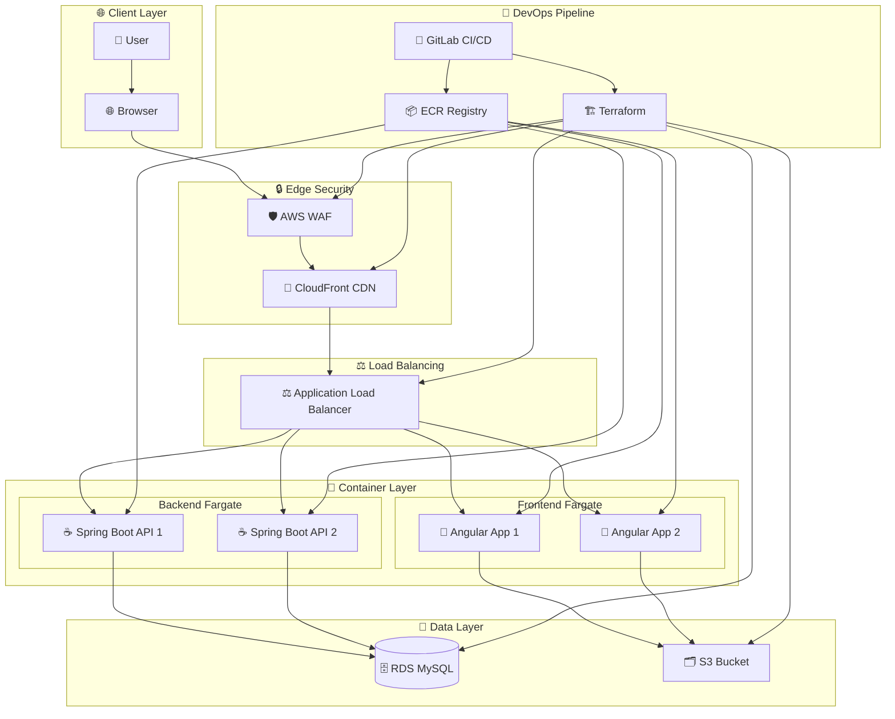

# 🚀 GitLab CI/CD + Terraform + AWS Fargate + Spring Boot + Angular + CloudFront + WAF

[](https://gitlab.com/cloudshare360/fargate-springboot-angular/-/pipelines)
[](https://gitlab.com/cloudshare360/fargate-springboot-angular/-/commits/main)
[](https://gitlab.com/cloudshare360/fargate-springboot-angular/-/releases)

> **A complete DevOps CI/CD pipeline showcasing modern cloud-native application deployment with GitLab CI/CD, Terraform Infrastructure as Code, AWS Fargate containerized microservices, Spring Boot REST API, Angular frontend, CloudFront CDN, and WAF security.**

## 📚 **[📋 Complete Architecture Documentation](./ARCHITECTURE.md)**

🏗️ **NEW**: Comprehensive architecture documentation with hierarchical navigation, detailed mermaid diagrams, and complete technical specifications covering:
- **Dual Deployment Modes**: Fargate containers vs S3 static hosting
- **System Architecture**: AWS infrastructure with security layers
- **CI/CD Pipeline**: Automated deployment workflows
- **Infrastructure as Code**: Terraform module organization
- **Monitoring & Security**: Complete observability strategy

---

## 🔗 Live Documentation (GitLab Pages)

The project documentation can be published to GitLab Pages with interactive navigation and mermaid diagrams:

- **📖 Intended live docs site:** https://cloudshare360.gitlab.io/gitlab-ci-terraform-aws-fargate-springboot-angular-cloudfront-waf/
- **📁 GitLab Repository:** https://gitlab.com/cloudshare360/gitlab-ci-terraform-aws-fargate-springboot-angular-cloudfront-waf

> **💡 Setup Instructions:** To enable GitLab Pages:
> 1. Push this repository to GitLab
> 2. The GitLab CI/CD pipeline will automatically build and deploy the documentation site
> 3. GitLab Pages will be available at the URL above once the pipeline completes
> 
> **Local Testing:** You can test the docs locally by running:
> ```bash
> cd docs && python3 -m http.server 8080
> # Then open http://localhost:8080 in your browser
> ```

---

## �📋 Table of Contents

- [🔥 Features](#-features)
- [🏗️ Architecture](#️-architecture)
- [🛠️ Tech Stack](#️-tech-stack)
- [📦 Project Structure](#-project-structure)
- [🚀 Quick Start](#-quick-start)
- [⚙️ Configuration](#️-configuration)
- [🔧 Development](#-development)
- [🚢 Deployment](#-deployment)
- [🔍 Monitoring](#-monitoring)
- [🔐 Security](#-security)
- [📊 Performance](#-performance)
- [🤝 Contributing](#-contributing)
- [📝 License](#-license)

## 🔥 Features

### 🚀 **DevOps & CI/CD**
- ✅ **GitLab CI/CD** - Complete pipeline with validation, build, test, security, and deployment stages
- ✅ **Infrastructure as Code** - Terraform modules for AWS resource provisioning
- ✅ **Automated Testing** - Unit tests, integration tests, and security scans
- ✅ **Blue-Green Deployments** - Zero-downtime deployments with rollback capabilities
- ✅ **Multi-Environment Support** - Dev, staging, and production environments

### ☁️ **Cloud Infrastructure**
- ✅ **AWS Fargate** - Serverless containers for backend and frontend
- ✅ **Application Load Balancer** - High availability with health checks
- ✅ **Amazon RDS MySQL** - Managed database with automated backups
- ✅ **Amazon S3** - Static asset storage and backup
- ✅ **CloudFront CDN** - Global content delivery network
- ✅ **AWS WAF** - Web application firewall protection
- ✅ **VPC with NAT Gateway** - Secure network architecture

### 🎯 **Application Features**
- ✅ **Spring Boot REST API** - Modern Java backend with JPA/Hibernate
- ✅ **Angular Frontend** - Responsive single-page application
- ✅ **User Management CRUD** - Complete user lifecycle management
- ✅ **Real-time Health Monitoring** - Application and infrastructure health checks
- ✅ **Security Integration** - CORS, input validation, and SQL injection prevention
- ✅ **Responsive Design** - Bootstrap-based mobile-friendly UI

## 🏗️ Architecture



### 🔄 **CI/CD Pipeline Flow**

```mermaid
graph LR
    A[📝 Code Commit] --> B[🔍 Validate]
    B --> C[🔨 Build]
    C --> D[🧪 Test]
    D --> E[🔒 Security Scan]
    E --> F[📋 Terraform Plan]
    F --> G[🚀 Terraform Apply]
    G --> H[🐳 Deploy Backend]
    H --> I[🎨 Deploy Frontend]
    I --> J[✅ Health Check]
    J --> K[📊 Performance Test]
    
    style A fill:#e1f5fe
    style K fill:#e8f5e8
```



## 🛠️ Tech Stack

### **Backend (Spring Boot)**
- ☕ **Java 21** - Latest LTS version with modern features
- 🍃 **Spring Boot 3.2** - Enterprise-grade framework
- 🗄️ **Spring Data JPA** - Database abstraction layer
- 🔒 **Spring Security** - Authentication and authorization
- 🐬 **MySQL 8.0** - Relational database
- 📊 **Spring Actuator** - Health monitoring and metrics
- 🧪 **JUnit 5** - Unit and integration testing

### **Frontend (Angular)**
- 🅰️ **Angular 17** - Modern frontend framework
- 📱 **Bootstrap 5** - Responsive UI framework
- 🎨 **Font Awesome** - Icon library
- 🔧 **TypeScript** - Type-safe JavaScript
- 🧪 **Jasmine/Karma** - Testing framework
- 📦 **npm** - Package manager

### **Infrastructure (AWS)**
- 🐳 **AWS Fargate** - Serverless containers
- ⚖️ **Application Load Balancer** - Traffic distribution
- 🗄️ **Amazon RDS** - Managed MySQL database
- 🗂️ **Amazon S3** - Object storage
- 📡 **CloudFront** - Content delivery network
- 🛡️ **AWS WAF** - Web application firewall
- 🌐 **VPC** - Virtual private cloud
- 📦 **ECR** - Container registry

### **DevOps Tools**
- 🦊 **GitLab CI/CD** - Continuous integration and deployment
- 🏗️ **Terraform** - Infrastructure as code
- 🐳 **Docker** - Containerization
- 🔍 **SonarQube** - Code quality analysis
- 📊 **Prometheus** - Monitoring and alerting
- 📈 **Grafana** - Metrics visualization

## 📦 Project Structure

```
gitlab-ci-terraform-aws-fargate-springboot-angular-cloudfront-waf/
├── 📁 backend/                    # Spring Boot API
│   ├── 📁 src/main/java/com/cloudshare360/api/
│   │   ├── 📁 controller/         # REST controllers
│   │   ├── 📁 service/           # Business logic
│   │   ├── 📁 repository/        # Data access layer
│   │   ├── 📁 model/             # Entity models
│   │   └── 📁 config/            # Configuration classes
│   ├── 📄 Dockerfile             # Backend container image
│   ├── 📄 pom.xml                # Maven dependencies
│   └── 📄 application.properties # App configuration
│
├── 📁 frontend/                   # Angular Application
│   ├── 📁 src/app/
│   │   ├── 📁 components/        # Angular components
│   │   ├── 📁 services/          # API services
│   │   ├── 📁 models/            # TypeScript models
│   │   └── 📁 environments/      # Environment configs
│   ├── 📄 Dockerfile             # Frontend container image
│   ├── 📄 nginx.conf             # Nginx configuration
│   ├── 📄 package.json           # Node dependencies
│   └── 📄 angular.json           # Angular CLI config
│
├── 📁 terraform/                  # Infrastructure as Code
│   ├── 📁 modules/               # Reusable Terraform modules
│   │   ├── 📁 vpc/               # VPC and networking
│   │   ├── 📁 ecs/               # ECS Fargate services
│   │   ├── 📁 rds/               # RDS database
│   │   ├── 📁 alb/               # Application Load Balancer
│   │   ├── 📁 cloudfront/        # CloudFront distribution
│   │   ├── 📁 waf/               # WAF web ACL
│   │   └── 📁 s3/                # S3 buckets
│   ├── 📄 main.tf                # Main Terraform config
│   ├── 📄 variables.tf           # Input variables
│   ├── 📄 outputs.tf             # Output values
│   └── 📄 environments.tf        # Environment-specific configs
│
├── 📁 docs/                       # Documentation
│   ├── 📄 DEPLOYMENT.md          # Deployment guide
│   ├── 📄 ARCHITECTURE.md        # Architecture details
│   └── 📄 API.md                 # API documentation
│
├── 📄 .gitlab-ci.yml             # GitLab CI/CD pipeline
├── 📄 README.md                  # This file
└── 📄 requirements.md            # Project requirements
```

## 🚀 Quick Start

### 📋 Prerequisites

Before you begin, ensure you have the following installed:

- 🐳 **Docker** (v20.10+)
- ☕ **Java 21**
- 📦 **Node.js** (v18+)
- 🅰️ **Angular CLI** (v17+)
- 🏗️ **Terraform** (v1.6+)
- ☁️ **AWS CLI** (v2.0+)
- 🦊 **GitLab Account** with CI/CD enabled

### 🔧 **1. Clone Repository**

```bash
git clone https://gitlab.com/cloudshare360/gitlab-ci-terraform-aws-fargate-springboot-angular-cloudfront-waf.git
cd gitlab-ci-terraform-aws-fargate-springboot-angular-cloudfront-waf
```

### 🏗️ **2. Infrastructure Setup**

#### Configure AWS Credentials
```bash
aws configure
# Enter your AWS Access Key ID, Secret Access Key, and Region
```

#### Initialize Terraform
```bash
cd terraform
terraform init
terraform plan
terraform apply
```

### 🐳 **3. Local Development**

#### Backend Development
```bash
cd backend
./mvnw spring-boot:run
# Backend will start on http://localhost:8080
```

#### Frontend Development
```bash
cd frontend
npm install
npm start
# Frontend will start on http://localhost:4200
```

### 🚢 **4. Container Deployment**

#### Build and Run with Docker Compose
```bash
docker-compose up --build
```

#### Or build individually:
```bash
# Backend
cd backend
docker build -t fargate-springboot-api .
docker run -p 8080:8080 fargate-springboot-api

# Frontend
cd frontend
docker build -t fargate-angular-frontend .
docker run -p 80:80 fargate-angular-frontend
```

## ⚙️ Configuration

### 🔐 **Environment Variables**

#### GitLab CI/CD Variables
Set these in your GitLab project settings (Settings → CI/CD → Variables):

```bash
AWS_ACCESS_KEY_ID=your_aws_access_key
AWS_SECRET_ACCESS_KEY=your_aws_secret_key
AWS_REGION=us-east-1
AWS_ACCOUNT_ID=123456789012
DB_PASSWORD=your_secure_database_password
DOMAIN_NAME=yourdomain.com
CERTIFICATE_ARN=arn:aws:acm:us-east-1:123456789012:certificate/xxxxx
```

#### Backend Environment Variables
```bash
DB_URL=jdbc:mysql://localhost:3306/fargatedb
DB_USERNAME=admin
DB_PASSWORD=your_password
AWS_REGION=us-east-1
```

#### Frontend Environment Variables
```bash
API_URL=http://localhost:8080
PRODUCTION=false
```

### 🏗️ **Terraform Variables**

Create a `terraform.tfvars` file in the terraform directory:

```hcl
aws_region = "us-east-1"
project_name = "fargate-springboot-angular"
environment = "dev"
vpc_cidr = "10.0.0.0/16"
availability_zones = ["us-east-1a", "us-east-1b"]
domain_name = "yourdomain.com"
certificate_arn = "arn:aws:acm:us-east-1:123456789012:certificate/xxxxx"
db_username = "admin"
db_password = "your_secure_password"
container_cpu = 512
container_memory = 1024
backend_desired_count = 2
frontend_desired_count = 2
enable_waf = true
enable_cloudfront = true
```

## 🔧 Development

### 🧪 **Running Tests**

#### Backend Tests
```bash
cd backend
./mvnw test                    # Unit tests
./mvnw integration-test        # Integration tests
./mvnw jacoco:report          # Coverage report
```

#### Frontend Tests
```bash
cd frontend
npm test                      # Unit tests
npm run e2e                   # End-to-end tests
npm run test:coverage         # Coverage report
```

### 🔍 **Code Quality**

#### Backend Code Quality
```bash
cd backend
./mvnw spotbugs:check         # Static analysis
./mvnw checkstyle:check       # Code style
./mvnw pmd:check              # PMD analysis
```

#### Frontend Code Quality
```bash
cd frontend
npm run lint                  # ESLint
npm run lint:fix              # Auto-fix issues
npm audit                     # Security audit
```

### 🐛 **Debugging**

#### Backend Debugging
```bash
cd backend
./mvnw spring-boot:run -Dspring-boot.run.jvmArguments="-Xdebug -Xrunjdwp:transport=dt_socket,server=y,suspend=n,address=5005"
```

#### Frontend Debugging
```bash
cd frontend
npm start
# Open browser dev tools for debugging
```

## 🚢 Deployment

### 🔄 **CI/CD Pipeline Stages**

#### 1️⃣ **Validation Stage**
- 🔍 Terraform syntax validation
- ☕ Java code compilation
- 🅰️ Angular build validation

#### 2️⃣ **Build Stage**
- 🐳 Docker image creation
- 📦 Push to ECR registry
- 🏷️ Image tagging

#### 3️⃣ **Test Stage**
- 🧪 Unit tests execution
- 📊 Code coverage reporting
- 🔒 Security scanning

#### 4️⃣ **Infrastructure Stage**
- 🏗️ Terraform plan generation
- 🚀 Infrastructure provisioning
- ✅ Resource validation

#### 5️⃣ **Deployment Stage**
- 🐳 ECS service updates
- ⚖️ Load balancer configuration
- 🔄 Blue-green deployment

#### 6️⃣ **Post-Deploy Stage**
- 🏥 Health checks
- 📊 Performance tests
- 📝 Deployment notifications

### 🔄 **Manual Deployment**

#### Deploy Infrastructure
```bash
cd terraform
terraform init
terraform plan -var-file="prod.tfvars"
terraform apply -var-file="prod.tfvars"
```

#### Deploy Applications
```bash
# Update ECS services
aws ecs update-service \
  --cluster fargate-springboot-angular-prod-backend-cluster \
  --service fargate-springboot-angular-prod-backend-service \
  --force-new-deployment

aws ecs update-service \
  --cluster fargate-springboot-angular-prod-frontend-cluster \
  --service fargate-springboot-angular-prod-frontend-service \
  --force-new-deployment
```

### 🔙 **Rollback Procedures**

#### Automatic Rollback
The pipeline includes automatic rollback triggers:
- Health check failures
- Error rate thresholds
- Performance degradation

#### Manual Rollback
```bash
# Rollback to previous task definition
aws ecs update-service \
  --cluster your-cluster \
  --service your-service \
  --task-definition your-task-definition:PREVIOUS

# Or use GitLab manual rollback job
```

## 🔍 Monitoring

### 📊 **Application Monitoring**

#### Health Endpoints
- **Backend Health**: `https://api.yourdomain.com/actuator/health`
- **Frontend Health**: `https://yourdomain.com/health`
- **Database Health**: Monitored via Spring Actuator

#### Metrics Collected
- 📈 **Response Times**: API and frontend performance
- 📊 **Throughput**: Requests per second
- 🚨 **Error Rates**: 4xx and 5xx responses
- 💾 **Resource Usage**: CPU, memory, disk usage
- 🔒 **Security Events**: WAF blocks, authentication failures

### 🏥 **Infrastructure Monitoring**

#### AWS CloudWatch Metrics
- **ECS Cluster Metrics**: CPU, memory utilization
- **ALB Metrics**: Request count, response times
- **RDS Metrics**: Database connections, query performance
- **CloudFront Metrics**: Cache hit ratio, edge performance

#### Custom Dashboards
- 📊 Application performance dashboard
- 🏗️ Infrastructure health dashboard
- 🔒 Security monitoring dashboard
- 💰 Cost optimization dashboard

### 🚨 **Alerting**

#### Alert Conditions
- 🔴 **Critical**: Service downtime, database failures
- 🟡 **Warning**: High error rates, performance degradation
- 🔵 **Info**: Deployment notifications, scaling events

#### Notification Channels
- 📧 Email notifications
- 💬 Slack integration
- 📱 PagerDuty for critical alerts
- 📊 GitLab issue creation

## 🔐 Security

### 🛡️ **Security Layers**

#### 1️⃣ **Network Security**
- 🌐 **VPC Isolation**: Private subnets for application components
- 🔥 **Security Groups**: Restrictive ingress/egress rules
- 🚪 **NAT Gateway**: Secure outbound internet access
- 🔒 **TLS/SSL**: End-to-end encryption

#### 2️⃣ **Application Security**
- 🔐 **Authentication**: Spring Security integration
- 🛡️ **Input Validation**: Prevents injection attacks
- 🚫 **CORS Configuration**: Cross-origin request protection
- 🔒 **SQL Injection Prevention**: Parameterized queries

#### 3️⃣ **Infrastructure Security**
- 🛡️ **AWS WAF**: Web application firewall rules
- 🔑 **IAM Roles**: Least privilege access
- 📦 **Container Security**: Non-root users, minimal base images
- 🔐 **Secrets Management**: AWS Secrets Manager integration

#### 4️⃣ **CI/CD Security**
- 🔍 **Dependency Scanning**: OWASP dependency check
- 🛡️ **Container Scanning**: Image vulnerability analysis
- 🔒 **Secret Scanning**: Prevent credential exposure
- 📝 **Audit Logging**: Complete deployment trail

### 🔒 **Security Best Practices**

#### Container Security
```dockerfile
# Use non-root user
RUN groupadd -r spring && useradd -r -g spring spring
USER spring:spring

# Use minimal base images
FROM openjdk:21-jdk-slim
```

#### Database Security
```sql
-- Create dedicated application user
CREATE USER 'fargate_app'@'%' IDENTIFIED BY 'secure_password';
GRANT SELECT, INSERT, UPDATE, DELETE ON fargatedb.* TO 'fargate_app'@'%';
```

#### WAF Rules
- 🚫 SQL injection protection
- 🛡️ XSS attack prevention
- 🔒 Rate limiting rules
- 🌍 Geographic restrictions

## 📊 Performance

### ⚡ **Performance Optimizations**

#### Backend Optimizations
- 💾 **Connection Pooling**: Optimized database connections
- 📦 **Caching**: Redis for session and data caching
- 🔄 **Lazy Loading**: JPA lazy initialization
- 📊 **Query Optimization**: Database index optimization

#### Frontend Optimizations
- 📦 **Bundle Optimization**: Tree shaking and code splitting
- 🖼️ **Image Optimization**: WebP format and lazy loading
- 💾 **Caching Strategy**: Service worker implementation
- 📡 **CDN Integration**: CloudFront global distribution

#### Infrastructure Optimizations
- 🔄 **Auto Scaling**: ECS service auto scaling
- ⚖️ **Load Balancing**: Multi-AZ distribution
- 📊 **Database Performance**: Read replicas and query optimization
- 🌐 **Content Delivery**: CloudFront edge caching

### 📈 **Performance Metrics**

#### Target Performance KPIs
- ⚡ **Page Load Time**: < 2 seconds
- 🚀 **API Response Time**: < 500ms (95th percentile)
- 📊 **Throughput**: 1000+ requests/second
- 💾 **Database Query Time**: < 100ms average
- 🌐 **CDN Cache Hit Ratio**: > 85%

#### Performance Testing
```bash
# Load testing with Artillery
npm install -g artillery
artillery run load-test.yml

# Database performance testing
./mvnw test -Dtest=PerformanceTest

# Frontend performance testing
npm run lighthouse
```

## 📈 Scaling

### 🔄 **Auto Scaling Configuration**

#### ECS Auto Scaling
```hcl
resource "aws_appautoscaling_target" "ecs_target" {
  max_capacity       = 10
  min_capacity       = 2
  resource_id        = "service/${aws_ecs_cluster.main.name}/${aws_ecs_service.main.name}"
  scalable_dimension = "ecs:service:DesiredCount"
  service_namespace  = "ecs"
}

resource "aws_appautoscaling_policy" "ecs_policy_cpu" {
  name               = "cpu-scaling"
  policy_type        = "TargetTrackingScaling"
  resource_id        = aws_appautoscaling_target.ecs_target.resource_id
  scalable_dimension = aws_appautoscaling_target.ecs_target.scalable_dimension
  service_namespace  = aws_appautoscaling_target.ecs_target.service_namespace

  target_tracking_scaling_policy_configuration {
    predefined_metric_specification {
      predefined_metric_type = "ECSServiceAverageCPUUtilization"
    }
    target_value = 70.0
  }
}
```

#### Database Scaling
- 📊 **Read Replicas**: Horizontal read scaling
- 🔄 **Connection Pooling**: Optimized connection management
- 💾 **Query Optimization**: Index and query performance tuning

### 📊 **Capacity Planning**

#### Resource Requirements
| Component | CPU | Memory | Storage | Network |
|-----------|-----|--------|---------|---------|
| Backend | 512 vCPU | 1GB RAM | 20GB | 1Gbps |
| Frontend | 256 vCPU | 512MB RAM | 10GB | 1Gbps |
| Database | 2 vCPU | 4GB RAM | 100GB SSD | 10Gbps |

## 🔧 Troubleshooting

### 🐛 **Common Issues**

#### Backend Issues
```bash
# Check application logs
docker logs fargate-springboot-api

# Database connection issues
./mvnw spring-boot:run -Dspring.profiles.active=debug

# Memory issues
./mvnw spring-boot:run -Xmx2g -Xms1g
```

#### Frontend Issues
```bash
# Build errors
npm run build -- --verbose

# Runtime errors
npm start -- --sourceMap

# Network issues
npm run start -- --proxy-config proxy.conf.json
```

#### Infrastructure Issues
```bash
# Terraform state issues
terraform refresh
terraform plan

# ECS service issues
aws ecs describe-services --cluster your-cluster --services your-service

# Load balancer issues
aws elbv2 describe-target-health --target-group-arn your-target-group-arn
```

### 📝 **Debug Procedures**

#### 1️⃣ **Application Debugging**
1. Check application logs in CloudWatch
2. Verify environment variables
3. Test database connectivity
4. Review security group rules

#### 2️⃣ **Infrastructure Debugging**
1. Validate Terraform state
2. Check AWS resource status
3. Review IAM permissions
4. Verify network connectivity

#### 3️⃣ **CI/CD Debugging**
1. Review pipeline logs
2. Check GitLab variables
3. Validate Docker images
4. Test deployment scripts

## 🤝 Contributing

We welcome contributions to improve this project! Here's how you can help:

### 🔄 **Development Workflow**

1. 🍴 **Fork** the repository
2. 🌿 **Create** a feature branch (`git checkout -b feature/amazing-feature`)
3. ✅ **Commit** your changes (`git commit -m 'Add amazing feature'`)
4. 📤 **Push** to the branch (`git push origin feature/amazing-feature`)
5. 🔄 **Open** a Merge Request

### 📋 **Contribution Guidelines**

#### Code Standards
- ☕ **Java**: Follow Google Java Style Guide
- 🅰️ **TypeScript**: Use Angular coding standards
- 🏗️ **Terraform**: Follow HashiCorp best practices
- 📝 **Documentation**: Update README for significant changes

#### Testing Requirements
- 🧪 **Unit Tests**: Maintain 80%+ code coverage
- 🔄 **Integration Tests**: Test API endpoints
- 🏗️ **Infrastructure Tests**: Validate Terraform modules
- 🔒 **Security Tests**: Run security scans

#### Review Process
- 👀 **Code Review**: Minimum 2 approvals required
- ✅ **Pipeline**: All CI/CD checks must pass
- 📝 **Documentation**: Update relevant documentation
- 🧪 **Testing**: All tests must pass

### 🐛 **Bug Reports**

When reporting bugs, please include:
- 🔍 **Environment**: OS, browser, versions
- 📝 **Steps**: Detailed reproduction steps
- 📊 **Expected**: Expected behavior
- 📋 **Actual**: Actual behavior
- 📸 **Screenshots**: If applicable

### 💡 **Feature Requests**

For feature requests, please include:
- 🎯 **Problem**: What problem does this solve?
- 💡 **Solution**: Proposed solution
- 🔧 **Implementation**: Implementation approach
- 📊 **Impact**: Expected impact and benefits

## 📚 Additional Resources

### 📖 **Documentation**
- [📋 API Documentation](docs/API.md)
- [🏗️ Architecture Deep Dive](docs/ARCHITECTURE.md)
- [🚀 Deployment Guide](docs/DEPLOYMENT.md)
- [🔒 Security Guide](docs/SECURITY.md)

### 🔗 **External Links**
- [🍃 Spring Boot Documentation](https://spring.io/projects/spring-boot)
- [🅰️ Angular Documentation](https://angular.io/docs)
- [🏗️ Terraform AWS Provider](https://registry.terraform.io/providers/hashicorp/aws/latest/docs)
- [☁️ AWS Fargate Documentation](https://docs.aws.amazon.com/fargate/)
- [🦊 GitLab CI/CD Documentation](https://docs.gitlab.com/ee/ci/)

### 🎓 **Learning Resources**
- [☁️ AWS Free Tier](https://aws.amazon.com/free/)
- [🏗️ Terraform Tutorials](https://learn.hashicorp.com/terraform)
- [🐳 Docker Best Practices](https://docs.docker.com/develop/dev-best-practices/)
- [🔒 Security Best Practices](https://owasp.org/www-project-top-ten/)

## 📄 License

This project is licensed under the **MIT License** - see the [LICENSE](LICENSE) file for details.

## 👥 Authors & Acknowledgments

### 👨‍💻 **Main Contributors**
- **CloudShare360** - *Initial work and architecture* - [@cloudshare360](https://gitlab.com/cloudshare360)

### 🙏 **Acknowledgments**
- Spring Boot team for the excellent framework
- Angular team for the modern frontend framework
- HashiCorp for Terraform
- AWS for the cloud infrastructure
- GitLab for the CI/CD platform

### 🏆 **Special Thanks**
- Open source community for tools and libraries
- DevOps community for best practices
- Security community for vulnerability research

---

## 📞 Support

### 🆘 **Getting Help**
- 📧 **Email**: support@cloudshare360.com
- 💬 **Discord**: [CloudShare360 Community](https://discord.gg/cloudshare360)
- 🐛 **Issues**: [GitLab Issues](https://gitlab.com/cloudshare360/fargate-springboot-angular/-/issues)
- 📖 **Wiki**: [Project Wiki](https://gitlab.com/cloudshare360/fargate-springboot-angular/-/wikis/home)

### 🔄 **Update Notifications**
- ⭐ **Star** this repository to stay updated
- 👀 **Watch** for releases and updates
- 📢 **Follow** [@cloudshare360](https://gitlab.com/cloudshare360) for announcements

---

<div align="center">

## 🚀 **Ready to Deploy?**

[](https://gitlab.com/cloudshare360/fargate-springboot-angular/-/blob/main/docs/DEPLOYMENT.md)
[](https://gitlab.com/cloudshare360/fargate-springboot-angular/-/blob/main/README.md#-quick-start)

**⭐ If this project helped you, please give it a star! ⭐**

</div>

---

<div align="center">
<sub>Built with ❤️ by <a href="https://gitlab.com/cloudshare360">CloudShare360</a></sub>
</div>