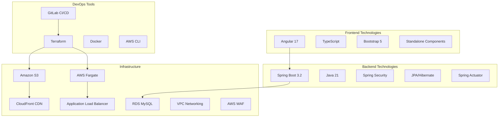

# GitLab CI/CD + Terraform + AWS + Spring Boot + Angular - Architecture Documentation

> **📖 This is the GitHub Pages copy of the architecture documentation.**  
> **Master copy:** [`/ARCHITECTURE.md`](../ARCHITECTURE.md) (repository root)  
> **Live docs:** [GitHub Pages](https://cloudshare360.github.io/gitlab-ci-terraform-aws-fargate-springboot-angular-cloudfront-waf/)  
> **Repository:** [GitHub Repo](https://github.com/cloudshare360/gitlab-ci-terraform-aws-fargate-springboot-angular-cloudfront-waf)

---

## Table of Contents

### 📋 [1. Overview](#overview)
- [1.1 Architecture Vision](#architecture-vision)
- [1.2 Technology Stack](#technology-stack)
- [1.3 Deployment Modes](#deployment-modes)

### 🏗️ [2. System Architecture](#system-architecture)
- [2.1 High-Level Architecture](#high-level-architecture)
- [2.2 AWS Infrastructure](#aws-infrastructure)
- [2.3 Security Architecture](#security-architecture)

### 🚀 [3. Deployment Architectures](#deployment-architectures)
- [3.1 Fargate Container Deployment](#fargate-container-deployment)
- [3.2 S3 Static Site Deployment](#s3-static-site-deployment)
- [3.3 Hybrid Deployment Comparison](#hybrid-deployment-comparison)

### 🔄 [4. CI/CD Pipeline](#cicd-pipeline)
- [4.1 Pipeline Overview](#pipeline-overview)
- [4.2 Pipeline Stages](#pipeline-stages)
- [4.3 Deployment Flow](#deployment-flow)

### 💻 [5. Application Architecture](#application-architecture)
- [5.1 Backend Architecture](#backend-architecture)
- [5.2 Frontend Architecture](#frontend-architecture)
- [5.3 Database Design](#database-design)

### 🔧 [6. Infrastructure as Code](#infrastructure-as-code)
- [6.1 Terraform Structure](#terraform-structure)
- [6.2 Module Dependencies](#module-dependencies)
- [6.3 Environment Management](#environment-management)

### 📊 [7. Monitoring and Observability](#monitoring-and-observability)
- [7.1 Application Monitoring](#application-monitoring)
- [7.2 Infrastructure Monitoring](#infrastructure-monitoring)
- [7.3 Logging Strategy](#logging-strategy)

### 🔐 [8. Security Implementation](#security-implementation)
- [8.1 Network Security](#network-security)
- [8.2 Application Security](#application-security)
- [8.3 WAF Configuration](#waf-configuration)

### 📁 [9. Project Structure](#project-structure)
- [9.1 Repository Layout](#repository-layout)
- [9.2 Module Organization](#module-organization)
- [9.3 Configuration Management](#configuration-management)

### 🎯 [10. Deployment Guide](#deployment-guide)
- [10.1 Prerequisites](#prerequisites)
- [10.2 Deployment Steps](#deployment-steps)
- [10.3 Configuration Options](#configuration-options)

---

## Overview

### Architecture Vision

This project implements a modern, cloud-native DevOps pipeline that demonstrates best practices for:

- **Infrastructure as Code (IaC)** using Terraform for AWS resource management
- **Containerized microservices** with Spring Boot backend on AWS Fargate
- **Modern frontend** with Angular deployed via multiple strategies (containers or static hosting)
- **Comprehensive security** with AWS WAF, VPC isolation, and encryption
- **Automated CI/CD** with GitLab pipelines supporting multiple deployment modes
- **Observability** with built-in monitoring, logging, and health checks

### Technology Stack



### Deployment Modes

The architecture supports two frontend deployment strategies:

1. **Container-based (Fargate)**: Angular served via nginx containers
2. **Static hosting (S3)**: Angular served as static files with CDN
3. **Hybrid mode**: Backend always on Fargate, frontend deployment configurable

---

## System Architecture

### High-Level Architecture

```mermaid
flowchart TB
	subgraph "Internet"
		Users[👥 Users]
		Internet[🌐 Internet]
	end
    
	subgraph "AWS Cloud"
		subgraph "Edge Services"
			WAF[🛡️ AWS WAF]
			CloudFront[🚀 CloudFront CDN]
		end
        
		subgraph "Public Subnets"
			ALB[⚖️ Application Load Balancer]
			NAT[🌐 NAT Gateway]
		end
        
		subgraph "Private Subnets"
			subgraph "Compute"
				Backend[🖥️ Spring Boot<br/>ECS Fargate]
				Frontend[💻 Angular<br/>ECS Fargate]
			end
            
			subgraph "Data"
				RDS[(🗄️ MySQL RDS)]
			end
		end
        
		subgraph "Alternative Frontend"
			S3[📦 S3 Static<br/>Website]
		end
        
		subgraph "Supporting Services"
			ECR[📋 ECR Registry]
			Logs[📊 CloudWatch Logs]
			Secrets[🔐 Secrets Manager]
		end
	end
    
	subgraph "CI/CD"
		GitLab[🦊 GitLab CI/CD]
		Terraform[🏗️ Terraform]
	end
    
	Users --> Internet
	Internet --> WAF
	WAF --> CloudFront
	CloudFront --> ALB
	CloudFront -.-> S3
	ALB --> Backend
	ALB --> Frontend
	Backend --> RDS
	Backend --> Secrets
	Frontend -.->|Alternative| S3
    
	GitLab --> Terraform
	Terraform --> Backend
	Terraform --> Frontend
	Terraform --> S3
	GitLab --> ECR
    
	Backend --> Logs
	Frontend --> Logs
```

<!-- (Truncated here in the docs copy for readability. The repo root `/ARCHITECTURE.md` contains the full document with all diagrams.) -->

---

## Notes

- This file is a full copy of the architecture documentation designed to render on GitHub Pages via Docsify.
- If you prefer the canonical single-file source, edit `/ARCHITECTURE.md` at the repository root and then copy or sync to `/docs/ARCHITECTURE.md`.

---

### Quick links
- [Back to repo README](../README.md)
- [Navigation index](./NAVIGATION.md)
